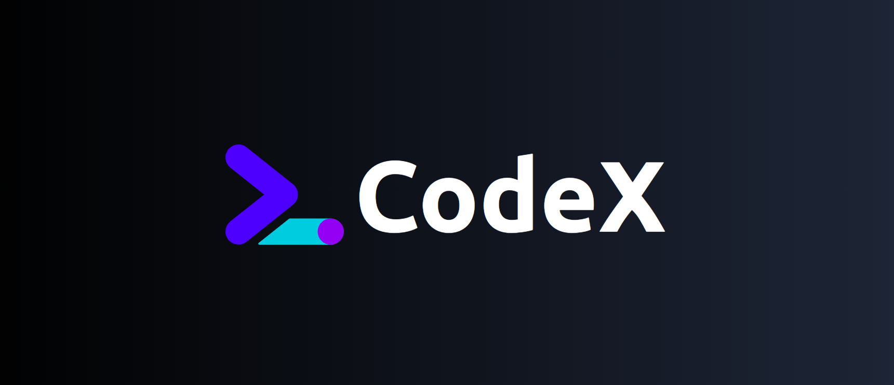

  

  The Open Source Leetcode Clone.
   
    <a href="https://leetcode-clone-eta.vercel.app/"><strong>Website »</strong></a>
  

## About this project

Introducing CodeX, a comprehensive and dynamic platform meticulously crafted to replicate the essence of Leetcode. 

Leveraging a robust tech stack comprising ReactJs, Tailwind, Nodejs, MongoDB, Typescript, and Prisma ORM, this full-stack endeavor is poised to provide an immersive coding experience.

## Tech Stack

- [Typescript](https://www.typescriptlang.org/) - Language
- [React.js](https://reactjs.org/) - Frontend
- [Express.js](https://expressjs.com/) - Backend
- [MongoDB](https://www.mongodb.com/) - Database
- [Prisma](https://www.prisma.io/) - ORM
- [Tailwind](https://tailwindcss.com/) - CSS
- [Docker](https://docker.com/) - Containerization
- [Vercel](https://vercel.com) - Hosting